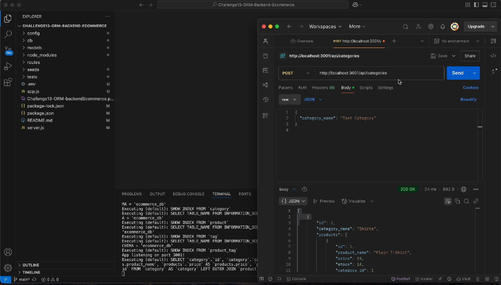

# E-Commerce Backend API

## 📋 Description
This project is a back-end e-commerce application that manages a product database using RESTful API principles. The application is built using **Node.js**, **Express.js**, **MySQL2**, and **Sequelize ORM**. It supports CRUD operations for categories, products, and tags.

The API allows users to:
- Create, read, update, and delete categories.
- Manage products and their related categories.
- Manage tags and link them with products.
- Handle complex relationships with Sequelize models.

This project simulates a real-world e-commerce backend that businesses might use to manage their inventory.

# [Link to walkthrough Video]([https://youtu.be/OCM8d3uCyYM](https://youtu.be/z5O2AewFk94))



---

## 🚀 Technologies Used
- Node.js
- Express.js
- MySQL2
- Sequelize ORM
- Jest (for testing)
- Supertest (for API testing)
- dotenv
- CORS

---

## 🔧 Installation Instructions

### 1. Clone the Repository
```bash
git clone https://github.com/yourusername/ecommerce-backend.git
cd ecommerce-backend
```
### 2. Install Dependenceis
- npm install 

### 3. Set Up Environmnt Variables
- DB_NAME='ecommerce_db'
- DB_USER='your_mysql_username'
- DB_PASSWORD='your_mysql_password

### 4. Create Database
- Open MySQL
- Run the SQL script

### 5. Seed the Database
- npm run seed

### 6. Run the Application
- npm run dev

### 7. Run Tests
- npm test
